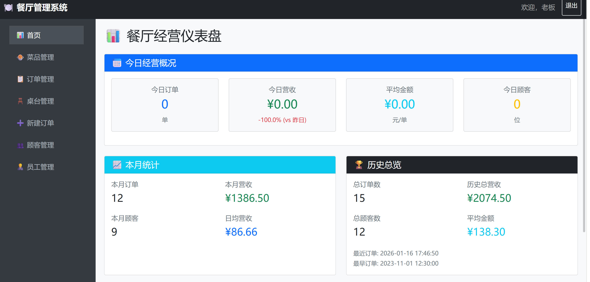
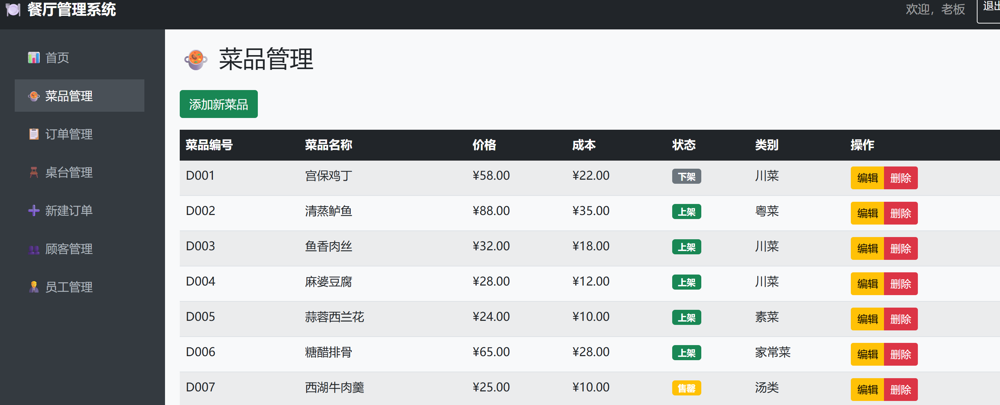
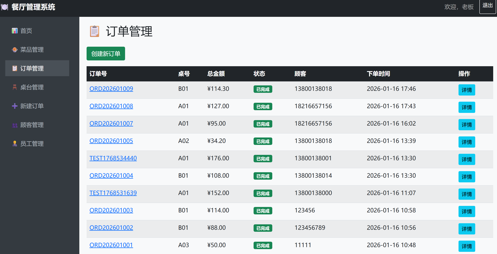
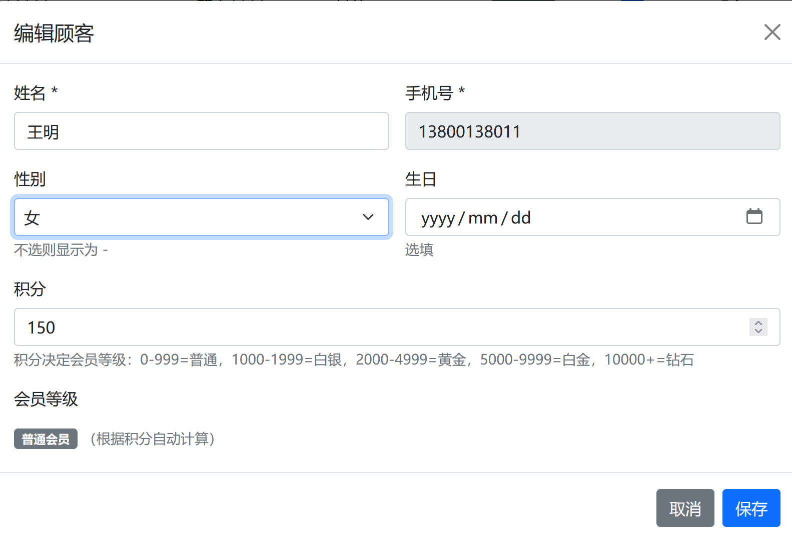

# 餐厅管理系统（Restaurant Management System）

为中小型餐饮企业提供的一站式后台管理方案，覆盖菜品、订单、顾客、员工、桌台五大核心业务场景，帮助企业实现从人工记录到数字化运营的快速过渡。

> 项目已完整上线运行，包含完整源码、数据库脚本及功能文档。


## 技术栈

- **后端**：Python Flask + MySQL 8.0
- **前端**：Bootstrap + Jinja2 模板引擎
- **工具**：PyCharm、Navicat、draw.io


## 核心功能

- **菜品管理**：菜品增删改查、图片上传、状态控制（上架/下架）、分类管理
- **订单管理**：自动生成订单号、会员折扣匹配、桌台状态联动、订单打印
- **顾客管理**：信息维护、积分累计、会员等级自动升级、新顾客自动建档
- **员工管理**：档案管理、在职状态跟踪
- **桌台管理**：状态实时更新（空闲/占用/清洁中/预订）、按区域可视化展示


## 会员折扣体系

| 会员等级 | 所需积分 | 折扣 |
|---------|---------|------|
| 白银会员 | 1000 | 9.5折 |
| 黄金会员 | 2000 | 9.0折 |
| 白金会员 | 5000 | 8.5折 |
| 钻石会员 | 10000 | 8.0折 |


## 数据库设计

- 6 张数据表：菜品、订单、顾客、员工、桌台、订单明细
- 外键关联保证数据完整性，有历史订单的菜品禁止删除


## 项目截图








## 快速开始（供技术面试官参考）

```bash
# 克隆项目
git clone https://github.com/adogfm/restaurant-management-system.git
cd restaurant-management-system

# 安装依赖
pip install flask mysql-connector-python

# 创建数据库（MySQL 中执行）
CREATE DATABASE restaurantdb CHARACTER SET utf8mb4;

# 修改 database.py 中的数据库密码

# 启动项目
python app.py
```

访问 `http://localhost:5000`，登录账号：`boss / 123456`


## 项目结构

```
├── app.py              # Flask 主应用
├── database.py         # 数据库操作封装
├── templates/          # HTML 模板文件
├── static/             # 静态资源
└── restaurantdb.sql    # 数据库脚本
```
